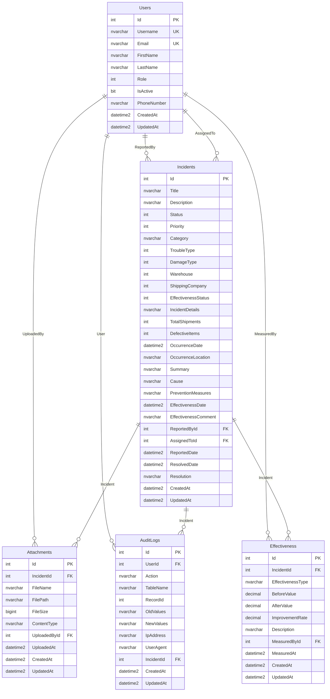

# 物流トラブル管理システム ER図

**作成日**: 2025-08-27  
**作成者**: システム開発チーム  
**バージョン**: 1.0

## 概要

本ドキュメントは、物流トラブル管理システムのデータベース設計におけるエンティティ間の関係性を図示したものです。

## ER図

## リレーションシップ詳細

### 1. Users → Incidents (1対多)

**ReportedBy 関係**
- 1人のユーザーは複数のインシデントを報告できる
- 1つのインシデントは必ず1人の報告者を持つ
- 制約: NOT NULL, RESTRICT

**AssignedTo 関係**
- 1人のユーザーは複数のインシデントを担当できる
- 1つのインシデントは最大1人の担当者を持つ
- 制約: NULL許可, SET NULL

### 2. Users → Attachments (1対多)

- 1人のユーザーは複数の添付ファイルをアップロードできる
- 1つの添付ファイルは必ず1人のアップロード者を持つ
- 制約: NOT NULL, RESTRICT

### 3. Users → AuditLogs (1対多)

- 1人のユーザーは複数の監査ログを生成できる
- 1つの監査ログは最大1人のユーザーに関連付けられる
- 制約: NULL許可, SET NULL（システム操作の場合）

### 4. Users → Effectiveness (1対多)

- 1人のユーザーは複数の有効性測定を実施できる
- 1つの有効性測定は必ず1人の測定者を持つ
- 制約: NOT NULL, RESTRICT

### 5. Incidents → Attachments (1対多)

- 1つのインシデントは複数の添付ファイルを持つことができる
- 1つの添付ファイルは必ず1つのインシデントに属する
- 制約: NOT NULL, CASCADE

### 6. Incidents → AuditLogs (1対多)

- 1つのインシデントは複数の監査ログを持つことができる
- 1つの監査ログは最大1つのインシデントに関連付けられる
- 制約: NULL許可, SET NULL

### 7. Incidents → Effectiveness (1対多)

- 1つのインシデントは複数の有効性測定を持つことができる
- 1つの有効性測定は必ず1つのインシデントに属する
- 制約: NOT NULL, CASCADE

## カーディナリティ

| エンティティ | 関係 | カーディナリティ | 説明 |
|--------------|------|------------------|------|
| Users | → | Incidents (ReportedBy) | 1:0..* | 1人のユーザーは0個以上のインシデントを報告 |
| Users | → | Incidents (AssignedTo) | 1:0..* | 1人のユーザーは0個以上のインシデントを担当 |
| Users | → | Attachments | 1:0..* | 1人のユーザーは0個以上の添付ファイルをアップロード |
| Users | → | AuditLogs | 1:0..* | 1人のユーザーは0個以上の監査ログを生成 |
| Users | → | Effectiveness | 1:0..* | 1人のユーザーは0個以上の有効性測定を実施 |
| Incidents | → | Attachments | 1:0..* | 1つのインシデントは0個以上の添付ファイルを持つ |
| Incidents | → | AuditLogs | 1:0..* | 1つのインシデントは0個以上の監査ログを持つ |
| Incidents | → | Effectiveness | 1:0..* | 1つのインシデントは0個以上の有効性測定を持つ |

## 制約ルール

### 必須項目 (NOT NULL)
- すべてのエンティティのId, CreatedAt, UpdatedAt
- Users: Username, Email, FirstName, LastName, Role, IsActive
- Incidents: Title, Description, Status, Priority, Category, TroubleType, DamageType, Warehouse, ShippingCompany, EffectivenessStatus, IncidentDetails, TotalShipments, DefectiveItems, OccurrenceDate, OccurrenceLocation, Summary, EffectivenessComment, ReportedById, ReportedDate
- Attachments: IncidentId, FileName, FilePath, FileSize, ContentType, UploadedById, UploadedAt
- AuditLogs: Action, TableName, CreatedAt, UpdatedAt
- Effectiveness: IncidentId, EffectivenessType, BeforeValue, AfterValue, ImprovementRate, Description, MeasuredById, MeasuredAt

### 一意制約 (UNIQUE)
- Users.Username
- Users.Email

### 外部キー制約
- Incidents.ReportedById → Users.Id (RESTRICT)
- Incidents.AssignedToId → Users.Id (SET NULL)
- Attachments.IncidentId → Incidents.Id (CASCADE)
- Attachments.UploadedById → Users.Id (RESTRICT)
- AuditLogs.UserId → Users.Id (SET NULL)
- AuditLogs.IncidentId → Incidents.Id (SET NULL)
- Effectiveness.IncidentId → Incidents.Id (CASCADE)
- Effectiveness.MeasuredById → Users.Id (RESTRICT)

## インデックス戦略

### プライマリキー
- すべてのテーブルのIdカラム

### ユニークインデックス
- Users.Username
- Users.Email

### 非ユニークインデックス
- Incidents.ReportedById
- Incidents.AssignedToId
- Attachments.IncidentId
- Attachments.UploadedById
- AuditLogs.UserId
- AuditLogs.IncidentId
- Effectiveness.IncidentId
- Effectiveness.MeasuredById

## データ整合性

### 参照整合性
- 外部キー制約により、参照先のデータが存在しない場合の挿入・更新を防止
- カスケード削除により、親レコード削除時の子レコードの適切な処理

### ドメイン整合性
- 列のデータ型と制約による値の妥当性確保
- チェック制約によるビジネスルールの強制

### エンティティ整合性
- プライマリキーによる一意性の確保
- IDENTITYによる自動採番の管理

---

**文書履歴**

| 日付 | バージョン | 変更内容 | 変更者 |
|------|------------|----------|--------|
| 2025-08-27 | 1.0 | 初版作成 | システム開発チーム |
